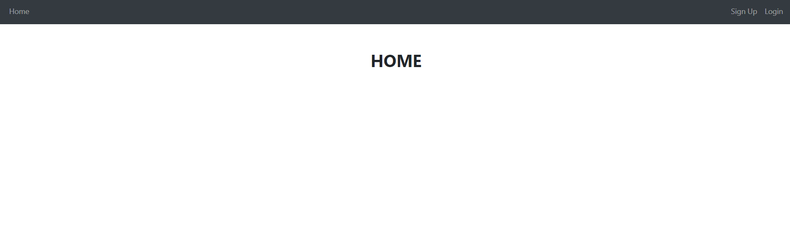
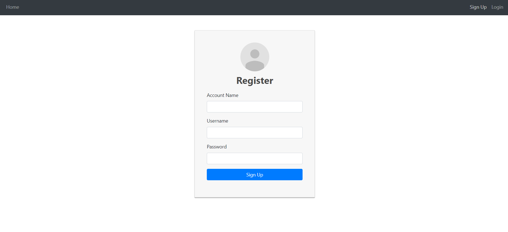
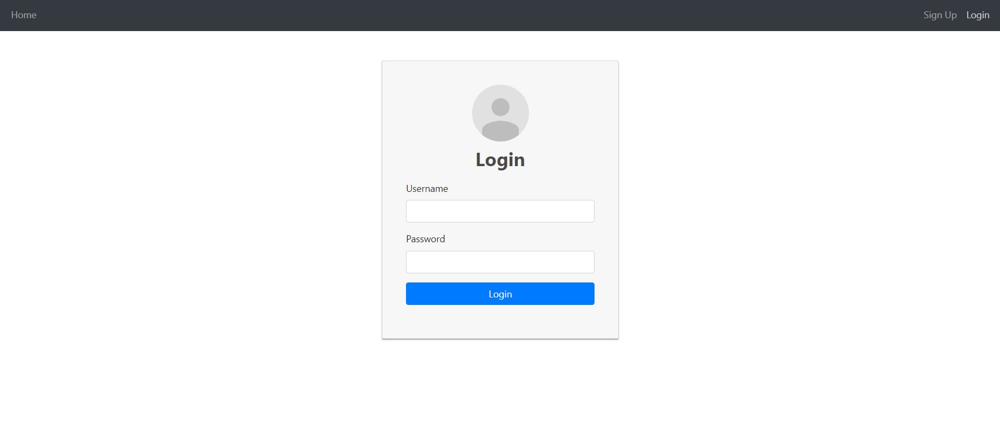
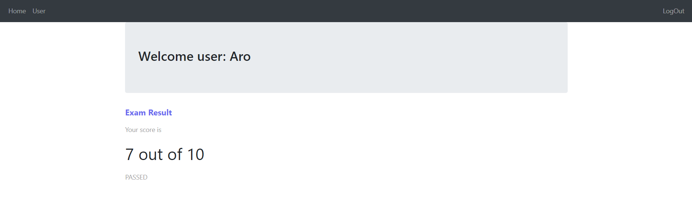

# Exam App

| Request url                             | Request                                                      | Response                                                     |
| --------------------------------------- | ------------------------------------------------------------ | ------------------------------------------------------------ |
| http://localhost:8080/api/auth/register | ```json {"accountName": "Account Name","username": "some_user_name","password": "some_password","roles": [1,2]}``` | ```json {"accountName": "Account Name","username": "some_username"}}``` |
| http://localhost:8080/api/auth/login    | ```json {"username": "some_username","password": "some_password"}``` | ```json {"token" : "actual_access_token"}```                 |
| http://localhost:8080/api/account       | ```json {"username": "some_username"}```                     | ```json {"score": 7,"accountName": "Account Name","passed": true/false}``` |

***Home Page***



***Register Page***



***Login Page***



***User Page***


